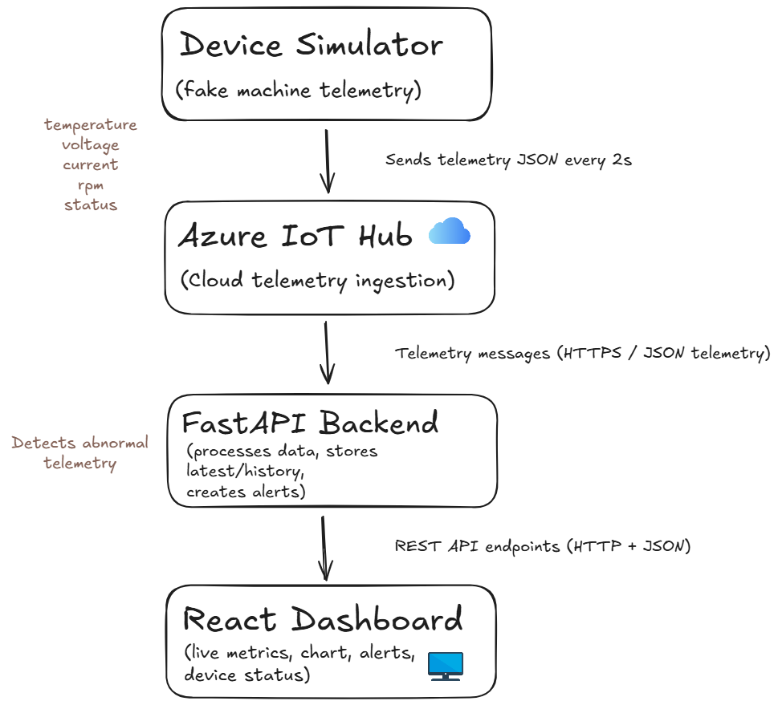
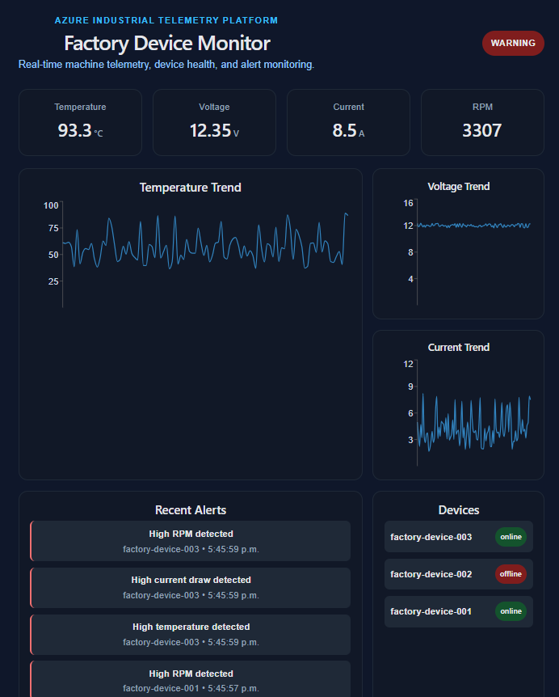
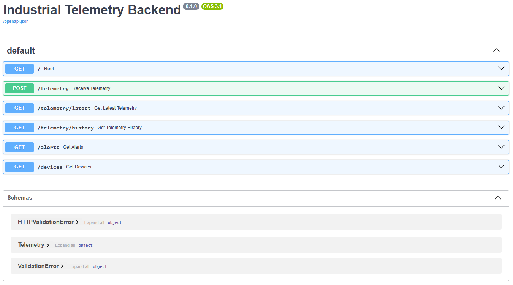
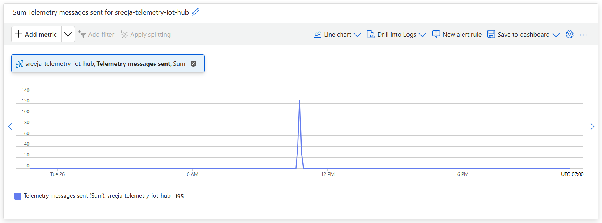

# Azure Industrial Telemetry Platform

## Overview

Cloud-connected industrial telemetry monitoring platform built with React, FastAPI, and Azure IoT Hub.

The platform simulates factory machine telemetry, processes live sensor data through a cloud-connected pipeline, generates alerts for abnormal conditions, and visualizes telemetry in a real-time dashboard.

This project demonstrates:
- Real-time telemetry ingestion
- Cloud-based device communication
- Backend telemetry processing
- Alert generation systems
- Live industrial monitoring dashboards
- Azure cloud deployment workflows

---

## Architecture

The system follows a full telemetry pipeline:

Device Simulator → Azure IoT Hub → FastAPI Backend → React Dashboard



---

## Features

- Real-time telemetry simulation
- Azure IoT Hub cloud ingestion
- FastAPI REST API backend
- React dashboard visualization
- Live telemetry trend charts
- Alert generation for abnormal telemetry
- Device monitoring and status tracking
- Multi-device telemetry support
- Cloud deployment with Azure services

---

## Tech Stack

### Frontend
- React
- TypeScript
- Vite
- Recharts

### Backend
- Python
- FastAPI

### Cloud & Deployment
- Azure IoT Hub
- Azure App Service
- Azure Static Web Apps

---

## API Endpoints

| Endpoint | Description |
|---|---|
| `/telemetry/latest` | Returns latest telemetry |
| `/telemetry/history` | Returns telemetry history |
| `/alerts` | Returns recent alerts |
| `/devices` | Returns device status information |

---

## Screenshots

### Real-Time Dashboard


### FastAPI Swagger Docs


### Azure IoT Hub Telemetry Activity


---

## How to Run

### 1. Start Backend

```bash
cd backend
source venv/bin/activate
uvicorn main:app --reload
```

---

### 2. Start Device Simulator

```bash
cd device-simulator
source venv/bin/activate
python simulator.py
```

---

### 3. Start Frontend

```bash
cd frontend
npm install
npm run dev
```

---

## Deployment

### Backend
- Azure App Service

### Frontend
- Azure Static Web Apps

### Cloud Messaging
- Azure IoT Hub

---

## Future Improvements

- Replace simulated telemetry with physical Arduino/Raspberry Pi sensor input
- Store historical telemetry in Azure Cosmos DB or PostgreSQL
- Add user authentication for protected device dashboards
- Add WebSocket support for lower-latency real-time updates
- Implement anomaly detection for predictive maintenance
- Add CI/CD testing for backend and frontend deployments
- Add role-based access control for industrial operators
- Add telemetry export and reporting functionality

---